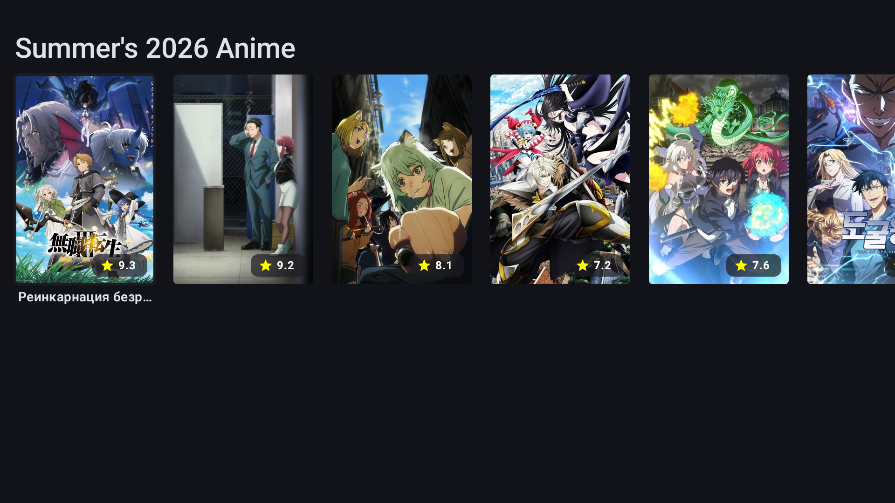
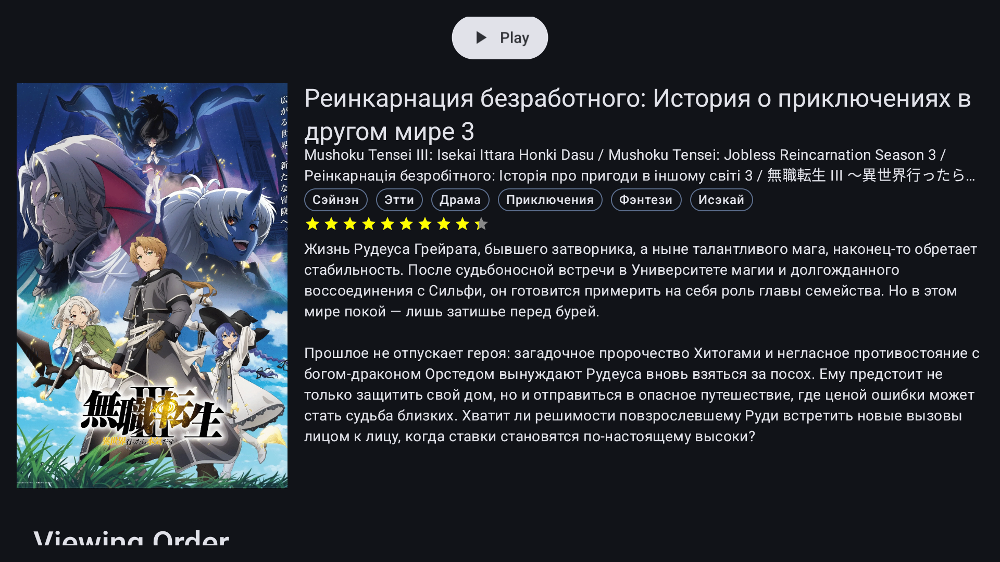

# DAVY

DAVY is a modern Android anime app for discovering and watching anime from the current season. It is
designed to feel lightweight and approachable while still offering a polished experience for
browsing, selecting episodes, and playing videos.

## Description

DAVY is built with Kotlin and Jetpack Compose, using a TV-friendly interface and a built-in media
player. The app pulls anime data from the Yummy API and helps users move quickly from discovery to
playback.

## Features

- Browse the current season's anime lineup
- Open detailed anime pages with synopsis, genres, ratings, and alternative titles
- Choose between available translations and players
- Select episodes directly from the anime details flow
- Watch videos with a built-in player powered by ExoPlayer
- TV-friendly layout with focus-based navigation

## Roadmap

- [x] Current season anime browsing
- [x] Built-in player
- [ ] Search
- [ ] Local watch history
- [ ] Integration with MyAnimeList and other watchlists
- [ ] Integration with other anime aggregators

## Screenshots

## Contributing

Contributions are welcome.

1. Fork the repository
2. Create a feature branch
3. Make your changes
4. Open a pull request

## License

This project is licensed under the GNU Affero General Public License v3.0. See
the [LICENSE](LICENSE) file for more information.
