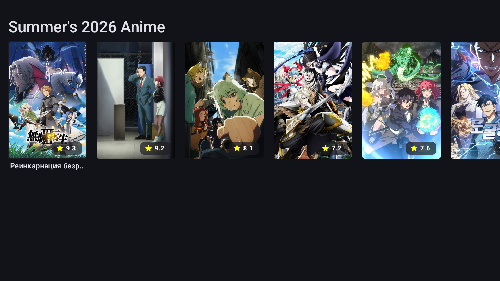
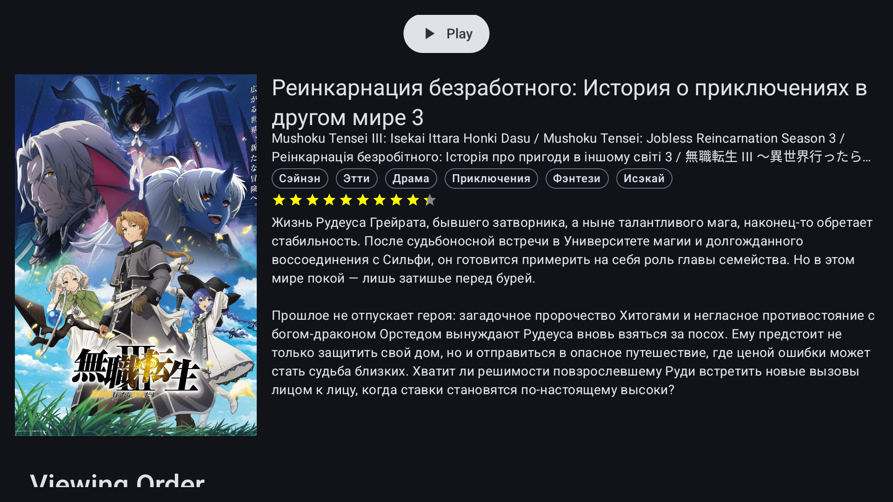

# DAVY


DAVY is a modern Android anime app for discovering and watching anime from the current season. It is
designed to feel lightweight and approachable while still offering a polished experience for
browsing, selecting episodes, and playing videos.

## Description

DAVY is built with Kotlin and Jetpack Compose, using a TV-friendly interface and a built-in media
player. The app pulls anime data from the Yummy API and helps users move quickly from discovery to
playback.

The application is primarily targeted at TV platforms (Android TV / Google TV) and is designed with
focus-based navigation and remote-friendly controls.

## Tech stack

- Kotlin
- Jetpack Compose (Compose for TV)
- ExoPlayer (media playback)
- AndroidX TV
- Yummy API (data source)
- Coroutines (asynchronous work)
- Retrofit & OkHttp (networking)

## Features

- Browse the current season's anime lineup
- Open detailed anime pages with synopsis, genres, ratings, and alternative titles
- Choose between available translations and players
- Select episodes directly from the anime details flow
- Watch videos with a built-in player powered by ExoPlayer
- TV-friendly layout with focus-based navigation

## Roadmap

- [x] Current season anime browsing
- [x] Built-in player
- [ ] Search ([#3](https://github.com/AsfhtgkDavid/davy/issues/3))
- [ ] Local watch history
- [ ] Integration with MyAnimeList and other watchlists
- [ ] Integration with other anime aggregators
- [ ] Adaptation for phones (mobile UI)

## Screenshots





## Donate

If you find DAVY helpful, consider supporting the project with a cryptocurrency donation:

- **TON/Gram (Toncoin)**: `UQD6fbJ73BmC7qPgoR_UrilSBu6kcBMPeNg-J9ZHlZOE1gFQ`
- **BTC (Bitcoin)**: `bc1q5xmq99krq0vykhzpgc5upl5vzttfdl2feflf53`
- **ETH (Ethereum)**: `0x87B0F2f291015Acd4a2A941cefE492F56E362d11`

Every contribution helps keep the project alive and funded!

## Contributing

Contributions are welcome. Please read [CONTRIBUTING.md](CONTRIBUTING.md) for the full development
workflow, coding guidelines, and pull request process.

If you want to add support for new player parsers, please work in the separate parser repository:

- https://github.com/AsfhtgkDavid/davy-parsers

Before submitting, make sure the project still builds:

```bash
./gradlew assembleDebug
```

## License

This project is licensed under the GNU Affero General Public License v3.0. See
the [LICENSE](LICENSE) file for more information.
